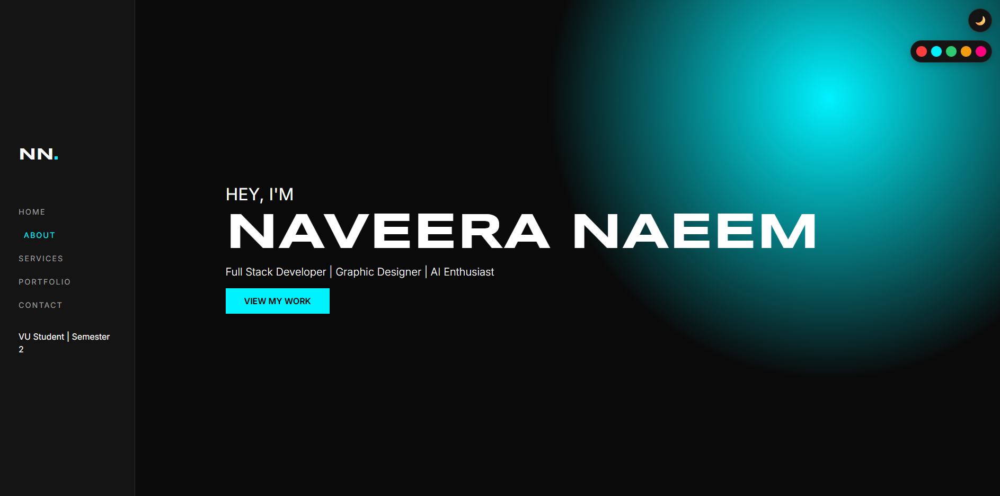
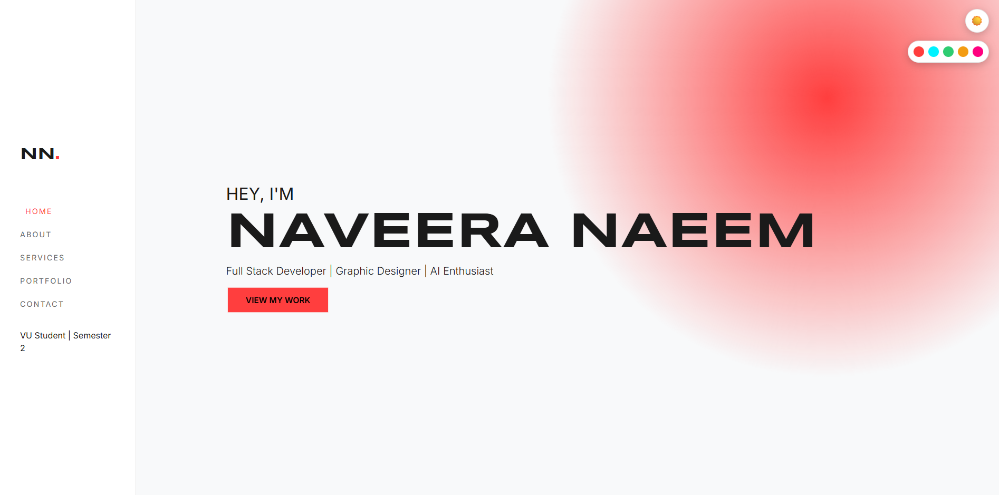
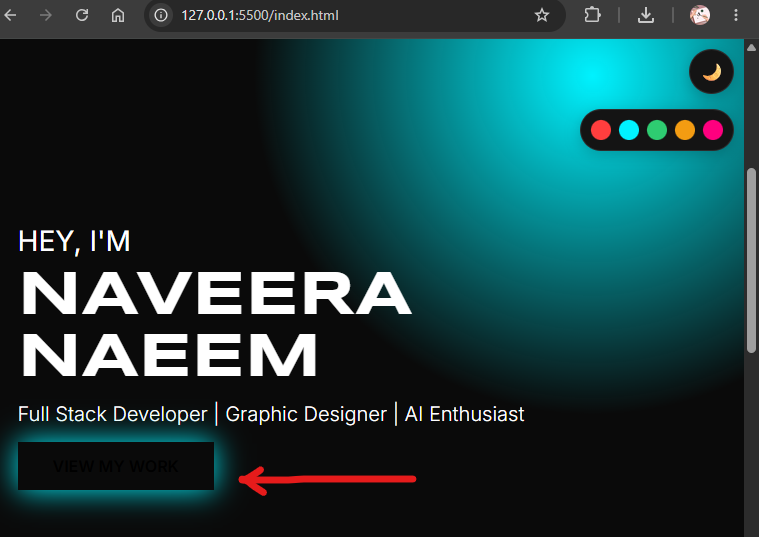
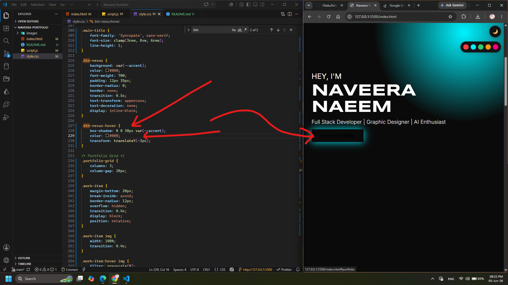
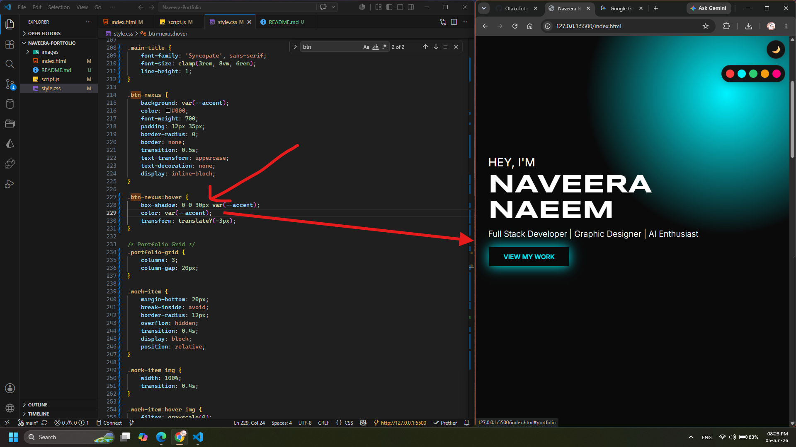
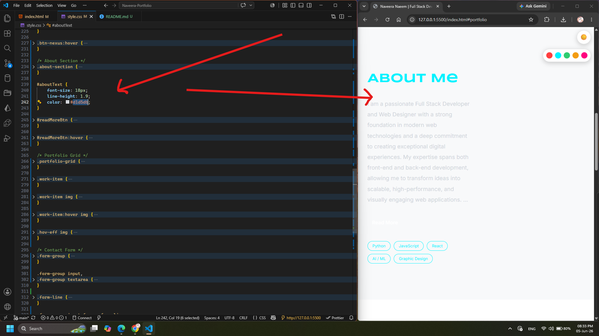
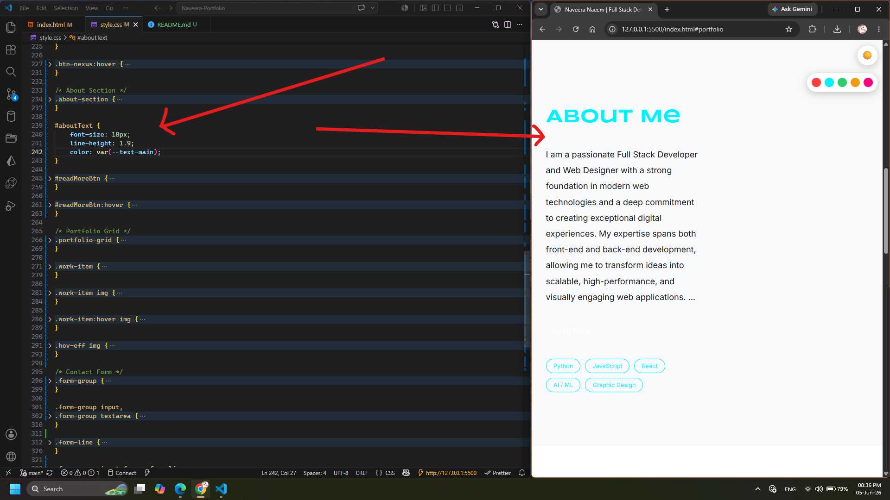

# 🌟 Personal Portfolio Website

Welcome to my personal portfolio repository! This website is designed to showcase my skills, projects, and journey as a developer. It features a modern, responsive design with dynamic themes to ensure a great user experience across all devices.

🔗 **Live Demo:** [View Live Portfolio](https://naveerarajchuhan.github.io/Naveera-Portfolio/)

---

## ✨ Features

- **Responsive Design:** Fully optimized for mobile, tablet, and desktop screens.
- **Light/Dark Mode Toggle:** Smooth transition between themes for comfortable viewing.
- **Project Showcase:** A clean grid featuring my latest work, built with live preview and source links.
- **Contact Integration:** A straightforward way for recruiters and collaborators to get in touch.

---

## 🛠️ Built With

This project is built purely using frontend web technologies to ensure fast loading times and smooth performance:

- **HTML5:** Semantic structure and content markup.
- **CSS3:** Custom styling, layouts (Flexbox/Grid), and theme variables.
- **JavaScript (ES6):** Interactive components, theme-switching logic, and animations.

---

## 📸 Portfolio Preview

🔗 **Dark Theme**

🔗 **Light Theme**

---

## 🚀 Last Bug Fixes

If you find a bug, I'm open to PRs & Suggestions. Here are some of the examples that were recently fixed by a GitHub fellow user [Afnan Muhammad](https://github.com/OtakuTotipotent).

🔗 **Details of Button Text fixes:**

- Problem

 

- Fix

🔗 **Details of About Section Text fixes:**

- Problem

- Fix

### Best Regards

🔗 **I am very thankful to [Naveera Naeem](https://github.com/NaveeraRajChuhan) for letting me do PRs & Collaboration with here project! Best regards: [Afnan Muhammad](https://github.com/OtakuTotipotent).**
